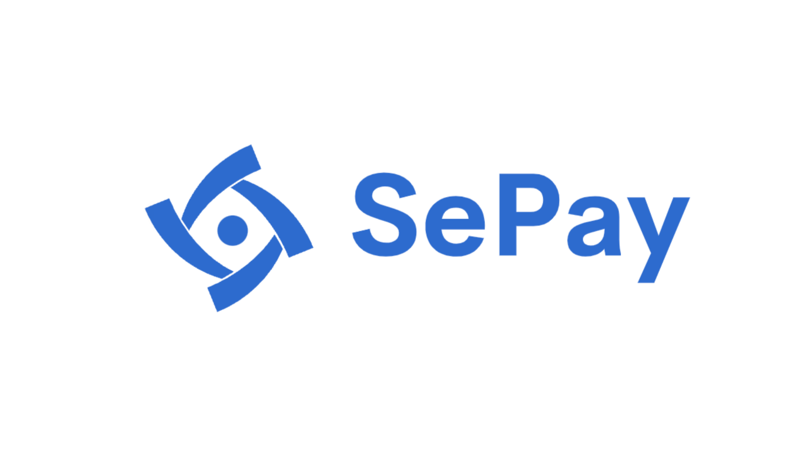
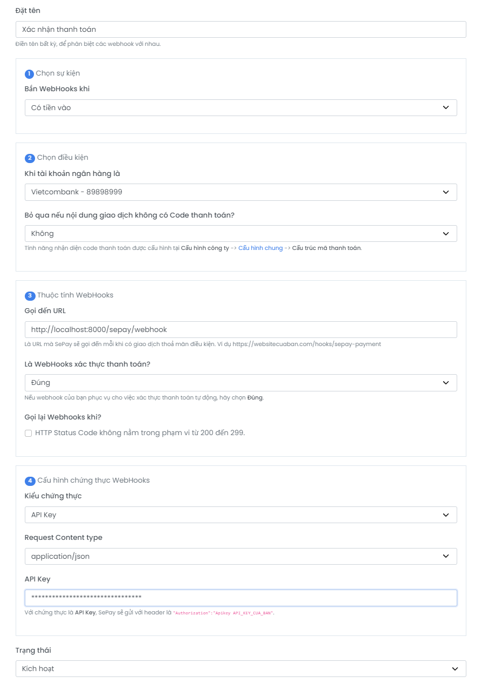
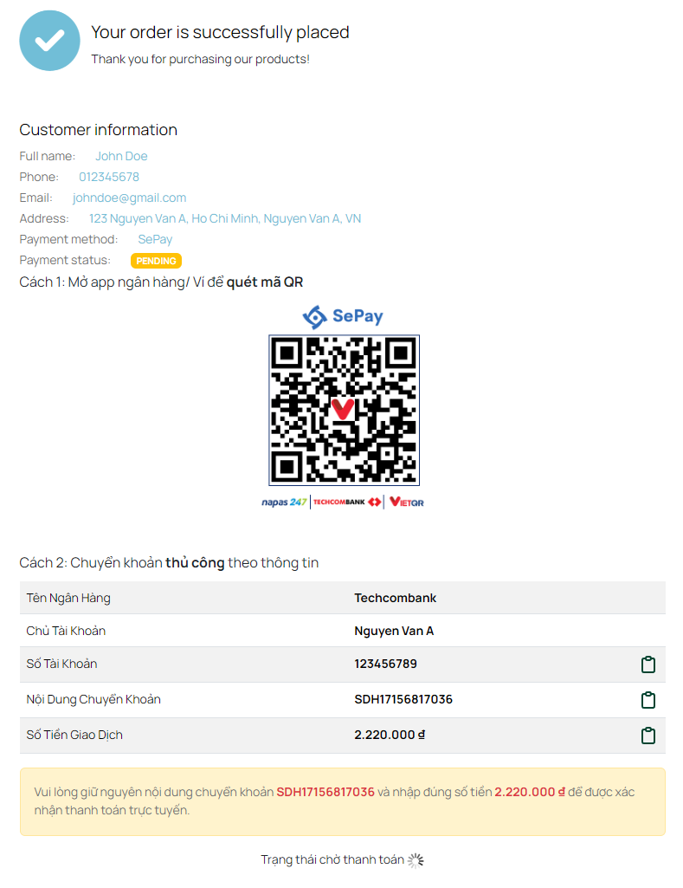
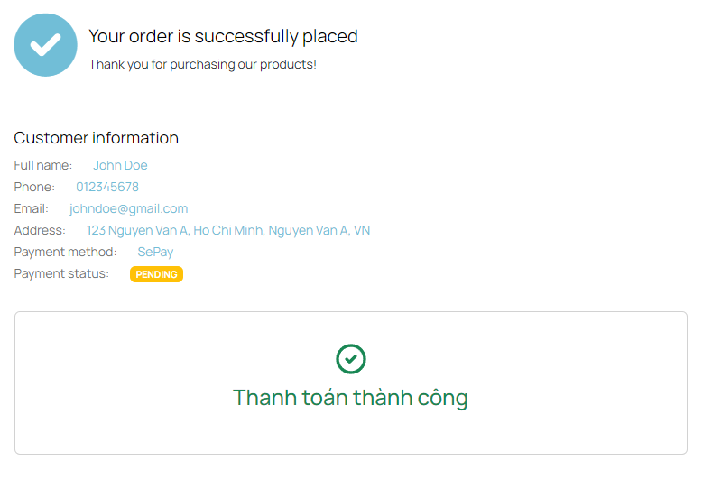
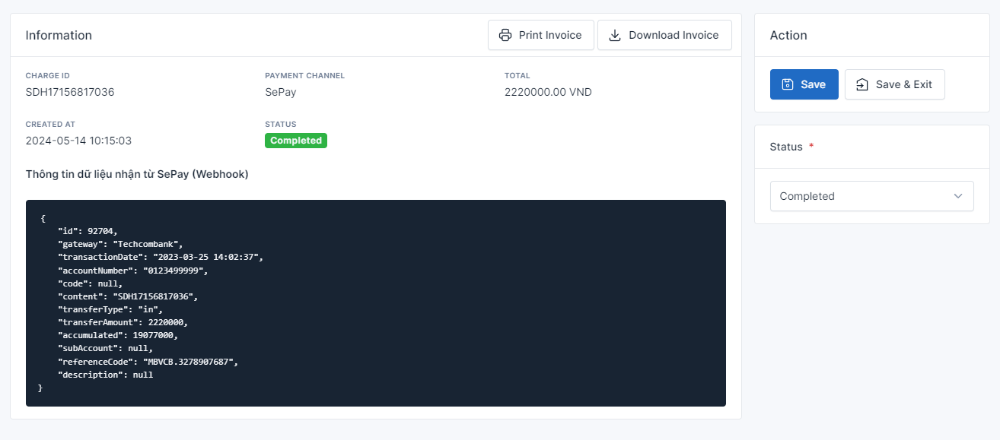

# SePay

Plugin này cho phép bạn tích hợp SePay để tự động xác thực thanh toán qua phương thức chuyển khoản ngân hàng.

## Yêu cầu tối thiểu

- Botble core 7.0.5 hoặc cao hơn.
- **QUAN TRỌNG 1: Vui lòng sử dụng tiền Việt (Đồng, VND) làm mặc định khi sử dụng phương thức thanh toán SePay. Số tiền được chuyển vào chỉ tính trên 1 lần và phải bằng hoặc lớn hơn tổng số tiền cần thanh toán cho 1 đơn.**
- **QUAN TRỌNG 2: Yêu cầu bắt buộc cần phải có tiền tố mã đơn hàng để sử dụng được tính năng này. Vui lòng điền đúng theo mô tả bên dưới của biểu mẫu khi bạn thiết lập phương thức.**

## Cài đặt

### Cài đặt thông qua bảng quản trị

Vào **Bảng quản trị (Admin)** và chọn **Plugins**. Bấm vào nút "Thêm mới (Add new)", tìm kiếm plugin **SePay** và sau đó bấm vào "Cài đặt (Install)".

### Cài đặt thủ công

1. Bạn có thể tải về các bản phát hành tại đây hoặc trên [Botble Marketplace](https://marketplace.botble.com/products/friendsofbotble/fob-sepay).
2. Giải nén file nén vào thư mục `platform/plugins`.
3. Vào **Bảng quản trị (Admin)**, chọn **Plugins**, và bấm vào nút **Kích hoạt (Activate)**.

## Cách sử dụng

1. Vào **Bảng quản trị (Admin)**, chọn **Thanh toán (Payments)**, và bấm vào **Phương thức thanh toán (Payment Methods)**.
2. Kích hoạt **SePay** bằng cách điền đầy đủ thông tin vào biểu mẫu:
   
3. Sao chép "Webhook URL" và mã bảo mật. Nếu "Mã bảo mật chưa được tạo", bấm vào nút bên dưới để tạo (nhớ sao chép mã vì nó chỉ hiển thị 1 lần duy nhất).
4. Truy cập vào "[My SePay](https://my.sepay.vn)" -> **Tích hợp webhooks** -> **Tạo Webhook Mới**.
5. Điền biểu mẫu như hình bên dưới. Lưu ý 3 điểm: Đường dẫn webhook, kiểu xác thực là *API Key*, và dán mã bảo mật được tạo ở Botble vào đó.
   
6. Tiến hành sử dụng như bình thường.
   
   
   

## Lịch sử thay đổi

Vui lòng xem [LỊCH SỬ THAY ĐỔI](CHANGELOG.md) để biết chi tiết.

## Bảo mật

Nếu bạn phát hiện bất kỳ vấn đề liên quan đến bảo mật nào, vui lòng gửi email tới friendsofbotble@gmail.com thay vì sử dụng issues.

## Credits

- [Friends Of Botble](https://github.com/FriendsOfBotble)
- [All Contributors](../../contributors)

## Giấy phép

MIT License (MIT). Vui lòng xem chi tiết trong phần [thông tin giấy phép](LICENSE).
